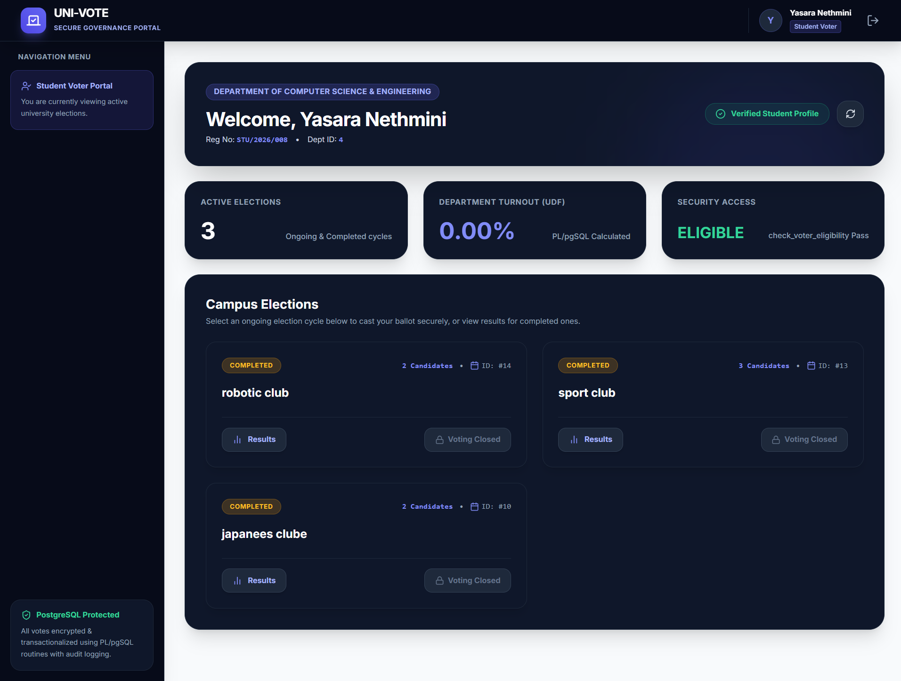

# 🗳️ University Online Voting System (PostgreSQL + Full Stack)

A robust, secure, and production-ready Database-driven Voting System designed for university-level elections. Built with **PostgreSQL**, **Express.js**, and **React**, focusing on transactional integrity, breach logging, performance optimization, and role-based access control (RBAC).

---

## ✨ Key Features & Technical Highlights

- **Double-Voting Prevention**: Real-time intercept triggers (`trg_prevent_double_voting`) to block duplicate voting attempts.
- **Audit Logging & Security Intercepts**: Automatically tracks security breach attempts and administrative actions in `audit_logs`.
- **Minimum Candidate Check**: Enforces business rules at the DB layer via `initialize_election_cycle` procedure (verifying $\ge 2$ candidates before starting).
- **Partial B-Tree Indexing**: Utilizes `idx_ongoing_elections` (`WHERE status = 'Ongoing'`) to optimize active lookup queries during high-concurrency live voting.
- **Role-Based Access Control (RBAC)**: Enforces Principle of Least Privilege (PoLP) using tailored roles like `Candidate_Manager`.
- **Analytical UDFs**: Custom PL/pgSQL functions for calculating overall campus voter turnout percentage and determining election winners dynamically.

---

## 🛠️ Tech Stack

- **Database Engine**: PostgreSQL 15+
- **Backend**: Node.js, Express.js
- **Frontend**: React.js, Tailwind CSS, Vite
- **Database Tools**: pgAdmin 4, psql CLI

---

## 📂 Database Architecture & Core Schema

### Core Tables
1. `student_profiles` — Master data for registered voters.
2. `elections` — Tracks election metadata and statuses (`Upcoming`, `Ongoing`, `Completed`).
3. `candidates` — Stores candidate entries linked to specific elections.
4. `votes` — Transactional record of cast ballots with strict uniqueness constraints.
5. `audit_logs` — Immutable audit trail for administrative actions and security intercepts.

---

## ⚙️ Key Database Objects

### 1. Triggers & Functions
- **`fn_prevent_double_voting()`**: Intercepts duplicate votes, records security breaches into `audit_logs`, and throws standard exceptions.

### 2. Stored Procedures
- **`initialize_election_cycle()`**: Atomic transaction handler that verifies candidate thresholds before opening an election.

### 3. User-Defined Functions (UDFs)
- **`calculate_campus_election_turnout(p_election_id)`**: Dynamically calculates overall voter turnout percentage.
- **`get_election_winner(p_election_id)`**: Aggregates total votes using `LEFT JOIN` and `GROUP BY` to retrieve winner details.

---

## ⚡ Performance Optimization Example

```sql
-- Partial Index targeting only active elections for rapid lookup
CREATE INDEX idx_ongoing_elections 
ON elections(election_id) 
WHERE status = 'Ongoing';


---

## 🖥️ System User Interface Showcase

<div align="center">

### 🔑 Authentication & Voter Portal
| Student Sign-In / Login | Student Voter Dashboard |
| :---: | :---: |
|  |  |

<br/>

### 🛡️ Administrative Dashboards (RBAC)
| Chief Election Officer Interface | Voter Manager Interface |
| :---: | :---: |
|  |  |

<br/>

### ⚡ Super Admin Control Panel
| Super Admin System Overview |
| :---: |
|  |

</div>

---
